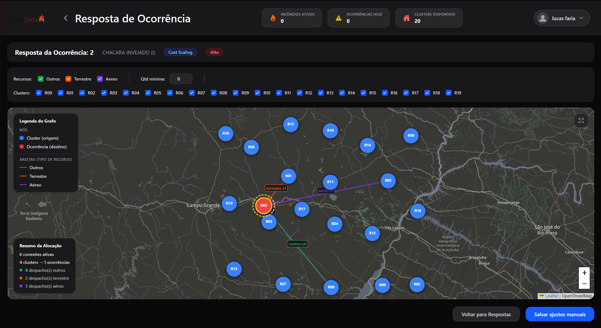

## Telas analisadas:

### Visualização de resposta:

Nessa tela o usuário pode visualizar a resposta do sistema para a pergunta feita. Ele pode visualizar o alocamento de recursos para cada ocorrência, o qual algorítimo decidiu ser o mais eficiente para cada situação.

## Tipo de teste:

Esse teste é um teste de visualização onde o usuário deve ser capaz de entender as informações apresentadas na tela, como o alocamento de recursos para cada ocorrência, e como isso pode ajudar a tomar decisões em situações de emergência. O teste também pode avaliar a clareza das informações apresentadas e se o usuário consegue interpretar corretamente os dados para tomar decisões informadas.

## Conjunto de perguntas:

1. Sabendo que a tela demonstra bases, recursos e ocorrências, qual a sua interpretação geral da tela?
2. Visualmente, como você identifica a classificação de cada recurso na tela?
3. Olhando para os dados, qual é o foco de ocorrência que está recebendo os recursos?
4. Quantos recursos o ponto r02 está alocando especificamente para a ocorrência de foco?

## Objetivo do teste:

O objetivo do teste é avaliar a capacidade do usuário de interpretar as informações apresentadas na tela de resposta, entender o alocamento de recursos para cada ocorrência, e como isso pode ajudar a tomar decisões em situações de emergência. O teste também visa identificar possíveis dificuldades ou confusões que o usuário possa ter ao interpretar os dados apresentados, e avaliar a clareza das informações para garantir que o sistema seja fácil de usar e compreensível para os usuários finais.

## Ação ou entendimento esperado:

O usuário deve ser capaz de interpretar corretamente as informações apresentadas na tela de resposta, entender o alocamento de recursos para cada ocorrência, e como isso pode ajudar a tomar decisões em situações de emergência. O usuário deve ser capaz de identificar quais recursos estão alocados para cada ocorrência, entender a classificação dos recursos, e interpretar os dados para tomar decisões informadas sobre como responder a uma situação de emergência. O teste também deve avaliar se o usuário consegue compreender as informações apresentadas de forma clara e fácil de entender.

